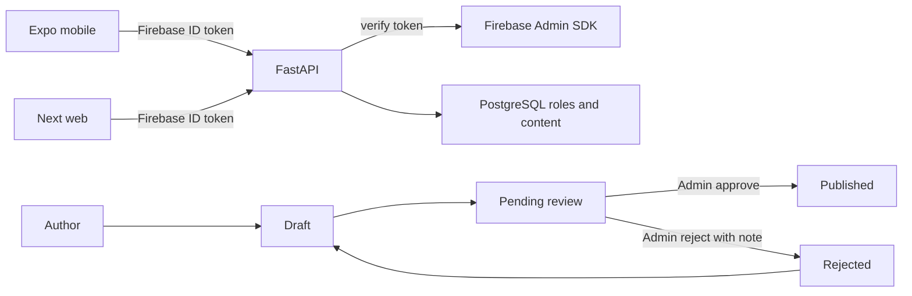

# Mobile-first publishing foundation

## Product rules đã chốt
- Free + approved/published: đọc toàn bộ không cần đăng nhập.
- Paid: preview chapter đầu không cần đăng nhập; login + purchase mới đọc full.
- Mọi người có thể đăng ký và bật author mode; admin không duyệt account, chỉ duyệt từng sách.
- Một primary category bắt buộc trước khi submit review.
- Chỉ nhận DOCX; PDF bị chặn ở cả picker và API.
- English là ngôn ngữ UI duy nhất trong phase này.

## Auth và dữ liệu

1. Thêm Firebase Admin SDK/config vào [`apps/api/app/auth.py`](apps/api/app/auth.py), [`apps/api/app/config.py`](apps/api/app/config.py), [`apps/api/requirements.txt`](apps/api/requirements.txt). API xác minh Firebase ID token; PostgreSQL vẫn là nguồn sự thật cho `reader | publisher | admin`. `ADMIN_EMAILS` bootstrap admin; user mới mặc định reader và có thể tự bật author mode.
2. Migrate auth client mobile và web sang Firebase email/password. Mobile dùng Firebase Auth persistence; shared client đổi token provider sang async trong [`packages/api-client/src/index.ts`](packages/api-client/src/index.ts). Bổ sung sign-up/sign-in/sign-out và sync profile. Không tự phát JWT/password hash mới; migration giữ user/content hiện tại bằng cách link account theo email verified lần đầu.
3. Tạo Alembic migration mới: `users.firebase_uid` unique/nullable, `password_hash` nullable, role thêm `admin`; `books.category_id`, status `draft | pending_review | published | rejected`, moderation fields (`submitted_at`, `reviewed_at`, `reviewed_by`, `review_note`); bảng `categories` với slug ổn định và English label. Seed taxonomy English: Fiction, Romance, Fantasy, Science Fiction, Mystery & Thriller, Horror, Historical Fiction, Literary Fiction, Young Adult, Poetry, Essays, Memoir & Biography, Self-Help, Business, Other.

## API và policy
1. Trong [`apps/api/app/routers/books.py`](apps/api/app/routers/books.py): chỉ chấp nhận `.docx` và MIME DOCX; category bắt buộc; author `submit-review` thay cho publish trực tiếp; sách pending không được chỉnh/split; rejected quay về draft khi author chỉnh; list công khai chỉ trả published.
2. Thêm admin router với queue pending, detail/preview, approve và reject bắt buộc note. Mọi endpoint enforce role server-side; mobile UI không phải lớp bảo mật.
3. Giữ access rule hiện tại trong [`apps/api/app/access.py`](apps/api/app/access.py): free published anonymous; paid preview anonymous; phần paid còn lại cần authenticated purchase. Pending/rejected chỉ owner và admin được xem.
4. Mở rộng DTO/method trong [`packages/api-client/src/index.ts`](packages/api-client/src/index.ts) cho category, moderation status, author activation và admin actions.

## Mobile-first UI
1. Cập nhật [`apps/mobile/lib/auth.tsx`](apps/mobile/lib/auth.tsx), [`apps/mobile/app/login.tsx`](apps/mobile/app/login.tsx) để dùng Firebase email/password, có Create account, và điều hướng theo role.
2. Trong [`apps/mobile/app/publisher/new.tsx`](apps/mobile/app/publisher/new.tsx): picker chỉ DOCX; chọn một category; copy nhấn mạnh original manuscript và formatting. API vẫn validate lại extension/MIME.
3. Trong [`apps/mobile/app/publisher/[id].tsx`](apps/mobile/app/publisher/[id].tsx): hiển thị moderation status/note; nút `Submit for review`; khóa edit khi pending; cho sửa và submit lại khi rejected.
4. Tạo mobile admin routes `admin/index` và `admin/[id]`: queue, metadata/category/chapter preview, Approve, Reject + reason. Hiện entry Admin theo role trong root navigation [`apps/mobile/app/_layout.tsx`](apps/mobile/app/_layout.tsx).
5. Web chỉ nhận phần auth/schema compatibility cần thiết; không xây admin dashboard hay redesign publisher web ở phase này.

## Implementation notes from codebase audit
- Hiện tại chỉ có JWT/bcrypt, role `reader|publisher`, status `draft|published`, PDF+DOCX, và không có category/admin — đúng với gap của phase này.
- [`apps/api/app/main.py`](apps/api/app/main.py) vừa `create_all` vừa Alembic: migration mới phải khớp models; coi Alembic là nguồn sự thật cho schema thay đổi.
- `password_hash` hiện NOT NULL — migration phải nullable khi chuyển Firebase; gỡ/đổi `POST /api/auth/login` password sang verify Firebase token + upsert profile.
- Tests hiện chỉ unit split/parse; phase này cần thêm route/auth/policy tests vì chưa có coverage HTTP.

## Verification
- Unit tests cho Firebase token verification (mock verifier), account linking, role guards, DOCX-only validation, state transitions, category required và access paid/free.
- Migration upgrade test trên schema hiện tại; API pytest đầy đủ.
- Mobile/web typecheck; mobile smoke flow: register → enable author → upload DOCX/category → split → submit → admin reject/resubmit/approve → anonymous free read và authenticated paid read.

## Roadmap sau foundation
- Phase 2: reader toggle Scroll/Flip, 3 font choices theo script/language, và professional library redesign theo category.
- Phase 3: AI suggest primary category + draft description từ extracted DOCX, luôn yêu cầu author xác nhận; provider abstraction và usage limits.
- Phase 4: i18n architecture và thêm locale sau khi English UX ổn định.
