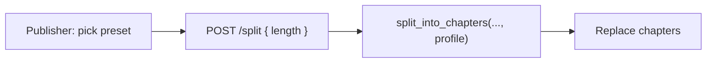

# Author-selectable split length presets

Đồng ý: độ dài part không nên cứng một mức. Author biết content (tiểu thuyết vs kịch vs essay), nên họ chọn lúc split — không đẩy gánh cho reader.

## Presets (3 mức)

| Key | Label | Target | Max | Min | Ý nghĩa |
|-----|-------|--------|-----|-----|---------|
| `short` | Short (~5–8 min) | 900 | 1400 | 350 | Session ngắn, thơ/essay, dense |
| `standard` | Standard (~10–15 min) | 2000 | 3000 | 650 | Mặc định hiện tại |
| `long` | Long (~20–25 min) | 3500 | 5000 | 1200 | Chapter dài, immersive |

Heading detection vẫn ưu tiên hơn word packing — preset chỉ đổi `TARGET_WORDS` / `MAX_WORDS` / `MIN_WORDS` khi gộp section.

## Approach

1. **API** — [`apps/api/app/chapters.py`](apps/api/app/chapters.py): thay hằng số đơn bằng `SPLIT_PROFILES` dict; `split_into_chapters(..., length="standard")` lấy profile. Endpoint [`POST /{book_id}/split`](apps/api/app/routers/books.py) nhận body optional `{ "length": "short"|"standard"|"long" }` (default `standard`). Không cần migration DB — lựa chọn là tham số lúc split, không lưu trên book (re-split thì chọn lại).

2. **Client** — [`packages/api-client`](packages/api-client/src/index.ts): `splitBook(id, { length? })`.

3. **UI** — Trước nút Auto-split trên [`apps/mobile/app/publisher/[id].tsx`](apps/mobile/app/publisher/[id].tsx) và [`apps/web/src/app/publisher/[id]/page.tsx`](apps/web/src/app/publisher/[id]/page.tsx): 3 chip chọn length (default Standard), gửi kèm khi split.

4. **Tests** — Thêm case short vs long cho cùng input ra số part khác nhau; giữ test cũ với `standard`.

## Ngoài scope

- Reader không chọn độ dài (chỉ author lúc split).
- Không slider tùy ý word count — 3 preset đủ rõ, tránh overfit.